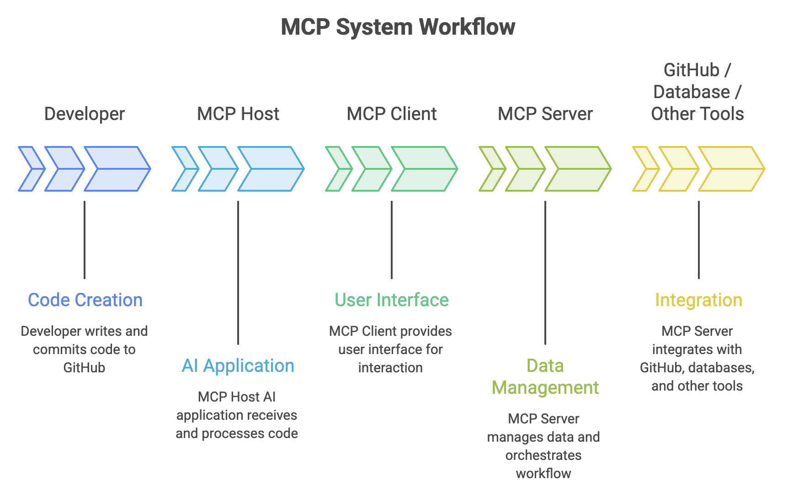

# GitHub MCP & Developer Agents

Modern AI-assisted development is moving beyond code generation. AI tools can now interact with GitHub repositories, issues, pull requests, workflows, and other development tools to perform multi-step tasks.

Two concepts are important:

- **MCP (Model Context Protocol)** - connects AI applications with external tools and data.
- **Developer Agents** - use AI reasoning and connected tools to perform development tasks.

> **MCP provides the connection while the agent uses that connection to perform the work.**


## What is MCP?

**Model Context Protocol (MCP)** is an open standard that allows AI applications to connect with external tools, data sources, and services through a common interface.

Without a standard protocol, an AI application may require separate integrations for different services.

With MCP:

```text
                ┌── GitHub
                │
AI Application ─ MCP ─ Database
                │
                └── Other Tools
```

This makes it possible for an AI application to use capabilities outside the AI model itself.

### MCP Analogy

Think of MCP as a **standard connection layer for AI**.

Just as a standard interface can allow different devices to work together, MCP provides a common way for AI applications to communicate with external tools and services.


### How MCP Works?

MCP follows a client-server architecture.



**Main Components**

| Component      | Role                                         |
| -------------- | -------------------------------------------- |
| **MCP Host**   | AI application used by the developer         |
| **MCP Client** | Connects the host to an MCP server           |
| **MCP Server** | Exposes tools and data to the AI application |

The MCP server acts as the bridge between the AI application and the external service.


### MCP Tools and Resources

MCP can expose capabilities that an AI application can use.

**Tools**

Tools allow an AI application or agent to perform actions.

For example, a GitHub MCP server may expose operations for:

```text
Search repository
Read file
Create issue
Update issue
Create pull request
View pull request
Inspect workflow
```

**Resources**

Resources provide information that the AI application can read.

Examples:

* Repository files
* Issue information
* Pull request details
* Structured project data

> **Tools allow the AI to act while resources allow it to access information.**


---


## GitHub MCP Server

The **GitHub MCP Server** connects an MCP-compatible AI application with GitHub.

A simplified architecture is:

```text
AI Application
      ↓
   MCP Client
      ↓
GitHub MCP Server
      ↓
   GitHub API
      ↓
    GitHub
```

This allows an AI application or agent to work with supported GitHub capabilities
through MCP.

### GitHub Capabilities

Depending on the available tools and permissions, an AI application may be able to:

* Read repository contents
* Search repositories
* Read and manage issues
* Work with pull requests
* Inspect pull request changes
* Work with files
* Inspect GitHub Actions workflow runs
* Access other supported GitHub operations

The exact capabilities depend on the MCP server configuration and permissions.

### Using MCP with GitHub

The real value of MCP becomes clearer with a practical example.

Suppose a developer asks:

```text
Find all open issues labeled "bug" in this repository and summarize the most important ones.
```

A simplified workflow is:

```text
Developer
    ↓
AI Application
    ↓
MCP Client
    ↓
GitHub MCP Server
    ↓
GitHub Issues
    ↓
Issue Data
    ↓
AI Application
    ↓
Summary
```

The AI does not need direct access to the GitHub interface itself.

Instead, it uses the capabilities exposed through the MCP server.


### Using MCP with Git

MCP becomes more useful when an AI application can work with both GitHub
and local development tools.

For example, a developer may ask:

```text
Review the changes in my current branch,
identify potential problems, and explain what
I should commit.
```

A tool-enabled AI workflow could involve:

```text
Developer
    ↓
AI Agent
    ↓
Git Tools
    ↓
Check Branch / Diff / Status
    ↓
Analyze Changes
    ↓
Suggest Improvements
```

The important point is that an AI agent can combine **repository context with development tools** rather than only generating code.


---


## What is a Developer Agent?

A **developer agent** is an AI system that can perform a sequence of development tasks instead of simply returning an answer or code suggestion.

### Traditional AI Assistance

```text
Developer
    ↓
Ask Question
    ↓
AI Suggestion
    ↓
Developer Performs the Work
```

### Agentic Development

```text
Developer
    ↓
Define Task
    ↓
Agent Analyzes Project
    ↓
Creates Plan
    ↓
Modifies Files
    ↓
Runs Commands / Tests
    ↓
Analyzes Results
    ↓
Makes Corrections
    ↓
Reports Result
```

The key difference is **task execution**.

An agent can reason about a goal and use available tools to complete multiple steps.


### Developer Agents with GitHub

A developer agent can fit naturally into the GitHub development workflow.

Consider an issue:

```text
Issue:
"Add validation for user registration."
```

An agent could work through the task:

```text
Issue
 ↓
Understand Requirements
 ↓
Analyze Repository
 ↓
Plan Changes
 ↓
Modify Code
 ↓
Add Tests
 ↓
Run Tests
 ↓
Review Results
 ↓
Create Pull Request
```

The developer can then review the generated changes through the normal GitHub Pull Request workflow.

This keeps the existing development model intact:

```text
Issue → Code → Test → Pull Request → Review → Merge
```

The agent simply automates parts of the process.


### GitHub Coding Agents

A **coding agent** can work on development tasks in a cloud environment rather than requiring the developer to drive every step from an IDE.

A typical workflow is:

```text
GitHub Issue
     ↓
Assign Task
     ↓
Coding Agent
     ↓
Analyze Repository
     ↓
Implement Changes
     ↓
Run Tests
     ↓
Create Pull Request
     ↓
Developer Review
```

This is particularly useful for well-defined tasks such as:

* Bug fixes
* Unit tests
* Documentation updates
* Routine refactoring
* Dependency maintenance
* Small feature changes


---


## MCP + Developer Agents

MCP and developer agents solve different problems.

```text
Developer
    ↓
AI Agent
    ↓
   MCP
    ↓
┌──────────┬──────────┬──────────┐
↓          ↓          ↓
GitHub     Git        Other Tools
```

The agent provides the reasoning and task execution.

MCP provides a standardized way for the agent to access external capabilities.


For example:

```text
GitHub Issue
      ↓
Agent reads Issue
      ↓
Uses repository tools
      ↓
Analyzes code
      ↓
Modifies files
      ↓
Runs tests
      ↓
Checks GitHub Actions
      ↓
Creates / updates Pull Request
```

This is where MCP becomes particularly valuable for developer workflows.


---


## Practical Git + GitHub + MCP Workflow

A modern developer workflow can combine Git, GitHub, MCP, agents, and automation.

```text
              Developer
                  ↓
             GitHub Issue
                  ↓
              AI Agent
                  ↓
                 MCP
                  ↓
       ┌──────────┼──────────┐
       ↓          ↓          ↓
      Git       GitHub     Tools
       ↓          ↓          ↓
       └──────────┼──────────┘
                  ↓
             Code Changes
                  ↓
              Git Commit
                  ↓
                Push
                  ↓
           Pull Request
                  ↓
          GitHub Actions
                  ↓
            Build & Test
                  ↓
          Human Code Review
                  ↓
                Merge
```

The important shift is:

```text
AI generates code
       ↓
AI uses tools
       ↓
AI performs tasks
       ↓
Human reviews the result
```

AI becomes part of the development workflow rather than simply being a
code-generation tool.


---


## When Should You Use MCP and Agents?

### MCP is useful when:

* An AI application needs access to external tools.
* You want standardized tool connectivity.
* AI needs GitHub or other service data.
* Multiple tools need to be connected to an AI application.

### Developer Agents are useful when:

* A task requires multiple steps.
* The task is well-defined.
* Several files need to be changed.
* Tests or commands need to be executed.
* The agent can iterate based on results.

### Avoid giving agents broad tasks without clear requirements.

For example:

```text
Good:
"Fix the failing UserService test."

Less suitable:
"Improve the entire application."
```


---


## Summary

* **MCP** is a standard for connecting AI applications with external tools and data.
* An **MCP server** exposes capabilities that an AI application can use.
* The **GitHub MCP Server** connects compatible AI applications with GitHub capabilities.
* **Developer agents** can reason about a task and perform multiple development steps.
* MCP provides **connectivity**; agents provide **reasoning and execution**.
* Agents can work with Git, GitHub, repositories, issues, pull requests, and other tools.
* GitHub Actions can provide automated build and test feedback to agent-driven workflows.
* Agents should use **minimum required permissions**.
* AI-generated changes must be reviewed and tested by developers.

