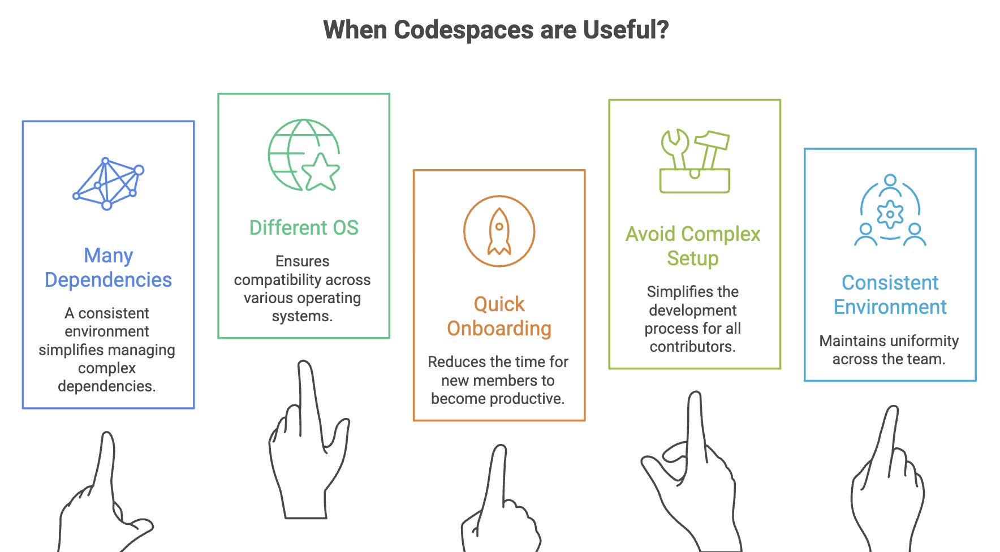
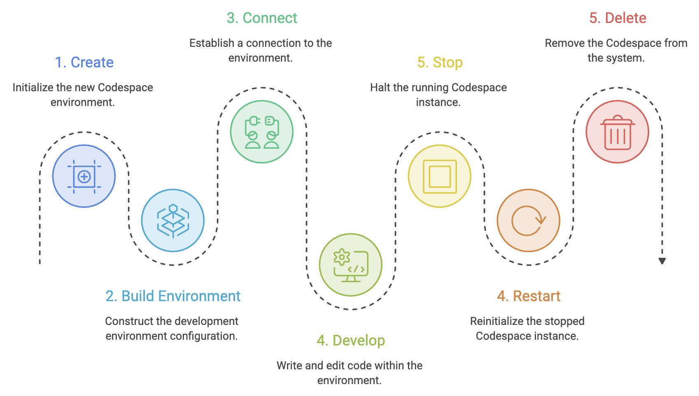
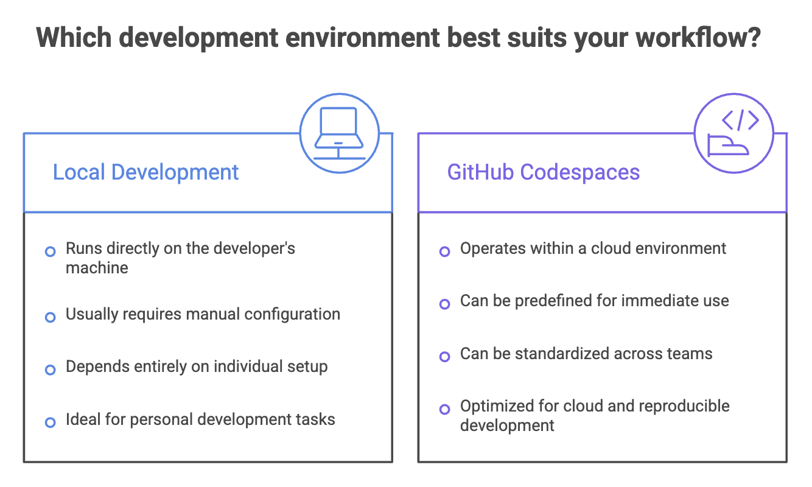

# GitHub Codespaces

Modern development does not always require a fully configured local machine. **GitHub Codespaces** provides a cloud-based development environment that can be created directly from a GitHub repository.

Instead of manually installing languages, tools, dependencies, and editor extensions, a project can define its development environment as configuration.

> **Think of Codespaces as a development machine in the cloud, configured for your project.**


## What is GitHub Codespaces?

**GitHub Codespaces** is a cloud-based development environment designed to provide a ready-to-use workspace for a GitHub repository.

A Codespace provides the tools developers normally expect from a local development environment, including:

- Code editor
- Terminal
- Git
- Debugging tools
- Project dependencies
- Development runtimes
- Extensions and configuration

Codespaces can be accessed through:

- Web browser
- VS Code
- Supported JetBrains IDEs
- Terminal through SSH

The environment runs in the cloud, allowing developers to work without depending entirely on the configuration of their local machine.


### Why Use Codespaces?

Setting up a project locally can involve several steps:

```text
Install Runtime
      ↓
Install IDE
      ↓
Install Dependencies
      ↓
Configure Tools
      ↓
Configure Environment
      ↓
Clone Repository
      ↓
Start Development
````

With Codespaces, much of this setup can be defined in the repository:

```text
GitHub Repository
       ↓
Create Codespace
       ↓
Configured Environment
       ↓
Start Development
```




### How Codespaces Works

A simplified view is:

```text
Developer
    ↓
Browser / VS Code / JetBrains
    ↓
GitHub Codespaces
    ↓
Cloud Development Environment
    ↓
Container
    ↓
GitHub Repository
```

The repository is made available inside the development environment.

The developer can then work with familiar tools such as:

```text
Editor
Terminal
Git
Debugger
Build Tools
Testing Tools
```

From the developer's perspective, the environment behaves much like a local development machine.


---


## Dev Containers

A major concept behind Codespaces is the **Dev Container**.

A repository can contain a configuration directory:

```text
.devcontainer/
    devcontainer.json
```

The `devcontainer.json` file describes how the development environment should be configured.

For example:

```json
{
  "name": "My Project",
  "image": "mcr.microsoft.com/devcontainers/typescript-node:1-20-bullseye",
  "forwardPorts": [3000],
  "postCreateCommand": "npm install"
}
```

The exact configuration depends on the project.

The important idea is:

> **The development environment becomes part of the project's configuration rather than depending entirely on each developer's machine.**


### Common `devcontainer.json` Options

| Option                 | Purpose                                   |
| ---------------------- | ----------------------------------------- |
| `image`                | Specifies the base container image        |
| `dockerFile` / `build` | Defines a custom container build          |
| `features`             | Adds reusable development tools           |
| `forwardPorts`         | Makes application ports accessible        |
| `postCreateCommand`    | Runs commands after environment creation  |
| `postStartCommand`     | Runs commands when the environment starts |
| `customizations`       | Configures editor settings and extensions |
| `containerEnv`         | Defines container environment variables   |

You do not need to memorize every option. The important concept is understanding that `devcontainer.json` describes the development environment.

### Dev Container Features

**Dev Container Features** are reusable components that add tools or capabilities to a development container.

For example, a project may need:

* Node.js
* Python
* Go
* Docker
* GitHub CLI
* AWS CLI
* Terraform

Instead of manually installing these tools every time, appropriate Features can be included in the container configuration.

This helps create more consistent and reproducible environments.


---


## Codespace Lifecycle

A Codespace generally follows this lifecycle:



### Stop vs Delete

These operations are different.

**Stop**

Stops the running environment while preserving the Codespace so it can be started again later.

**Delete**

Removes the Codespace environment.

A simple way to remember:

```text
Stop   → Pause the environment
Delete → Remove the environment
```

Storage can still incur costs while a stopped Codespace exists.


---


## Codespaces Prebuilds

Creating an environment may take time when dependencies and other project components need to be prepared.

**Codespaces Prebuilds** allow environments to be prepared in advance.

A simplified flow:

```text
Repository
    ↓
Prebuild
    ↓
Environment Prepared
    ↓
Create Codespace
    ↓
Start Developing Faster
```

Prebuilds are particularly useful for projects where environment creation requires significant setup.


---


## Port Forwarding

Applications running inside a Codespace can listen on ports such as:

```text
3000
8080
5432
```

Codespaces can forward these ports so developers can access applications from outside the development environment.

For example:

```text
Application
     ↓
Port 3000
     ↓
Codespace Port Forwarding
     ↓
Developer
```

This is useful when developing web applications, APIs, databases, and other network-based services.


---


## Dotfiles

Developers often maintain personal configuration files such as:

```text
.bashrc
.zshrc
.gitconfig
.vimrc
```

These are commonly called **dotfiles**.

Codespaces can apply a developer's dotfiles to new environments so that familiar:

* Shell settings
* Aliases
* Git configuration
* Editor preferences

can be reused.

This is useful for maintaining a familiar development experience across environments.


---


## Secrets

Codespaces can work with secrets for sensitive configuration.

Examples include:

* API keys
* Access tokens
* Service credentials

Sensitive values should not be committed directly to the repository.

> **Never hard-code passwords, API keys, or access tokens in source code or configuration files that are committed to Git.**

Use appropriate secret-management mechanisms instead.


---


## Copilot in Codespaces

Codespaces can be used with GitHub Copilot to provide an AI-assisted development environment.

A typical workflow can look like:

```text
GitHub Repository
       ↓
Codespace
       ↓
Editor + Terminal
       ↓
Copilot
       ↓
Write / Test / Debug
```

This combines a cloud development environment with AI-assisted coding.

The important distinction is:

* **Codespaces** provides the development environment.
* **Copilot** assists with development tasks.


---


## Collaboration

Codespaces can also be used in collaborative development scenarios.

For example:

* Pair programming
* Teaching
* Workshops
* Remote collaboration
* Working with contributors

Tools such as **Live Share** can be used for real-time collaboration where supported.


---





---


## Sumamry

* **GitHub Codespaces** provides cloud-based development environments. A Codespace can be created from a GitHub repository.
* Codespaces use **Dev Containers** to define development environments. `.devcontainer/devcontainer.json` contains environment configuration.
* **Dev Container Features** provide reusable development tools.
* **Prebuilds** prepare environments in advance to reduce creation time.
* **Port forwarding** allows applications inside Codespaces to be accessed externally.
* **Dotfiles** allow personal development configuration to be reused.
* Codespaces can be accessed through browsers, VS Code, supported JetBrains IDEs, and SSH, and it can be used with GitHub Copilot and collaboration tools.
* **Stopping** preserves a Codespace, while **deleting** removes it.


